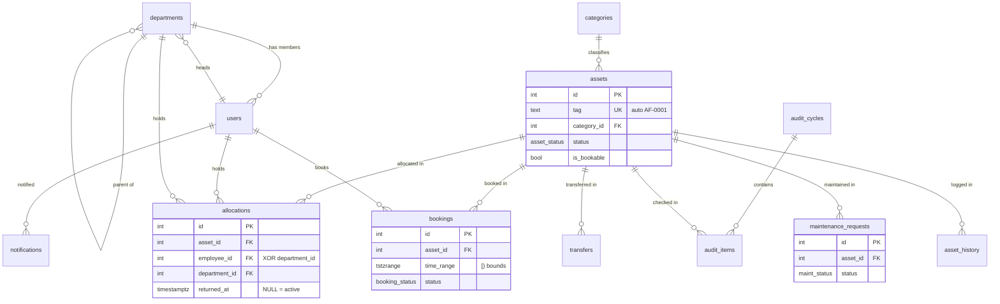

# AssetFlow — Enterprise Asset & Resource Management System

AssetFlow tracks the full lifecycle of an organization's assets and shared resources:
registration, allocation, time-boxed booking, maintenance, audits, and notifications —
with the hard business rules (no double-allocation, no overlapping bookings, approval-gated
maintenance, role-scoped actions) **enforced by the database itself**, so they hold even
under concurrent users.

> **Problem statement:** AssetFlow — Enterprise Asset & Resource Management (Odoo Hackathon 2026).

---

## Highlights (what to look at first)

- **Conflict-free allocation** — an asset can be held by at most one holder at a time. Enforced by a **partial unique index**, not an app-level check → safe under a race.
- **Overlap-free booking** — two bookings of the same resource can never overlap in time. Enforced by a **GiST exclusion constraint** on a `tstzrange` with half-open `[)` bounds (so 10:00–11:00 right after 09:00–10:00 is legal).
- **Employee XOR department allocation** — a `num_nonnulls(...) = 1` CHECK makes "exactly one target" a database fact.
- **Approval-gated maintenance** — asset status flips to *Under Maintenance* on approval and back to *Available* on resolve, inside a transaction.
- **No self-assigned admins** — signup always creates an `employee`; only an admin can promote roles.

---

## Tech stack

| Layer | Choice |
|---|---|
| Backend | **FastAPI** (Python), thin routers + service transactions |
| Database | **PostgreSQL** with **raw, parameterized SQL** (psycopg 3, pooled) — no ORM |
| Auth | **bcrypt** password hashing + **JWT in an httpOnly cookie** |
| Frontend | React 18 + Vite + TypeScript + Tailwind + TanStack Query + React Router |
| API docs | Swagger UI at `/docs` |

---

## Assumptions

- All timestamps are stored and compared in **UTC** (`timestamptz`).
- Booking time ranges are **half-open `[)`** — the end instant is exclusive, so back-to-back slots don't conflict.
- Photos are **URL strings** (no file upload); "QR code" search is plain text search over tag/serial/name.
- Booking statuses (Upcoming / Ongoing / Completed) are **derived from the current time vs. the range** — no cron job.
- "Nearing retirement" is a heuristic: `acquisition_date` older than a threshold (surfaced in Reports).
- Reschedule = cancel + rebook (no separate reschedule flow).

---

## Data model (ERD)



Full schema: [`server/app/migrations/0001_init.sql`](server/app/migrations/0001_init.sql).

---

## Business rules → enforcing mechanism

| Business rule | Enforced by |
|---|---|
| An asset has at most one **active** allocation | `CREATE UNIQUE INDEX one_active_allocation ON allocations(asset_id) WHERE returned_at IS NULL` → `UniqueViolation` → **409** "currently held by X" |
| Bookings of a resource **cannot overlap** | `EXCLUDE USING gist (asset_id WITH =, time_range WITH &&) WHERE status <> 'cancelled'` → `ExclusionViolation` → **409** |
| Back-to-back bookings are allowed | `tstzrange` **`[)`** bounds (end exclusive) |
| Allocate to employee **XOR** department | `CHECK (num_nonnulls(employee_id, department_id) = 1)` |
| No empty / wrongly-bounded booking range | `CHECK (NOT isempty(time_range))` + `CHECK (lower_inc AND NOT upper_inc)` |
| One open transfer request per asset | partial `UNIQUE (asset_id) WHERE status = 'requested'` |
| A department can't be its own parent | `CHECK (parent_id IS NULL OR parent_id <> id)` |
| Notification categories match the UI filter pills | `CHECK (type IN ('alert','approval','booking'))` |
| Emails are unique case-insensitively | `UNIQUE INDEX ON users (lower(email))` |
| Signup can't self-assign a privileged role | server forces `role = 'employee'`; role changes only via admin-only `PATCH /users/{id}/role` |
| Only managers approve maintenance / transfers | `require_roles(...)` dependency on the route |
| Asset status flips on maintenance approve/resolve | service-layer transaction (`SELECT … FOR UPDATE`) |

---

## Security

- Passwords hashed with **bcrypt**; never stored or returned in plaintext.
- Auth token is a **JWT in an httpOnly cookie** (not readable by JS); role is validated **live from the DB on every request** (a demoted user loses access immediately).
- **Signup creates employees only** — no role field is accepted from the client.
- Every privileged route is guarded server-side by `require_roles(...)`; the frontend is never trusted for authorization.
- **All SQL is parameterized** (`%s` placeholders) — no string interpolation of user input.
- `.env` is gitignored; `.env.example` is committed. Secrets are environment-driven.

---

## Running locally

**Prerequisites:** Python 3.12+, Node 18+, Docker (for PostgreSQL).

### 1. Database
```bash
docker run -d --name assetflow-db \
  -e POSTGRES_USER=assetflow -e POSTGRES_PASSWORD=assetflow -e POSTGRES_DB=assetflow \
  -p 5432:5432 postgres:16
# apply schema
docker exec -i assetflow-db psql -U assetflow -d assetflow < server/app/migrations/0001_init.sql
```

### 2. Backend (run from the repo root)
```bash
python -m venv .venv && source .venv/bin/activate
pip install -r requirements.txt
cp .env.example .env
python -m server.app.seed                 # rich demo data
uvicorn server.app.main:app --reload      # API at http://localhost:8000, docs at /docs
```

### 3. Frontend
```bash
cd client
npm install
npm run dev                                # http://localhost:5173
```

---

## Demo logins

Every seeded account uses the password **`password123`**.

| Role | Email |
|---|---|
| Admin | `admin@assetflow.com` |
| Asset Manager | `manager@assetflow.com` |
| Department Head | `aditi@assetflow.com` |
| Employee | `priya@assetflow.com` |

The seed includes the **Priya/Raj double-allocation** setup, **Room B2 booked 09:00–10:00 today**, one **3-day-overdue** allocation, maintenance across all five kanban columns, a pending transfer, and a closed Q3 audit — so a fresh clone is never a ghost town.
